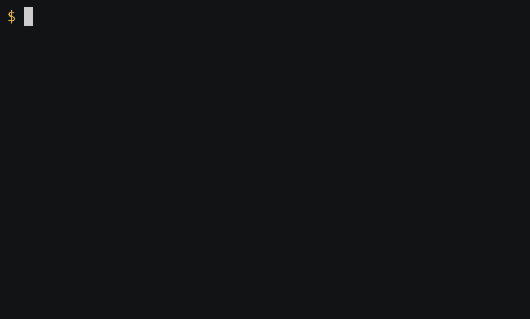

The "cast" screenshots were made with asciienema and then running through `asciicast2gif`.

For example:

```
asciinema rec trepan-xpy-assign.cast
```

You can edit the `.cast` files. The specific commands used after this were:

```console
$
$ asciicast2gif -w 60 -h 16 trepan-xpy-assign.{cast,gif}
$ asciicast2gif -w 60 -h 16 trepan-xpy-ifelse.{cast,gif}

```
